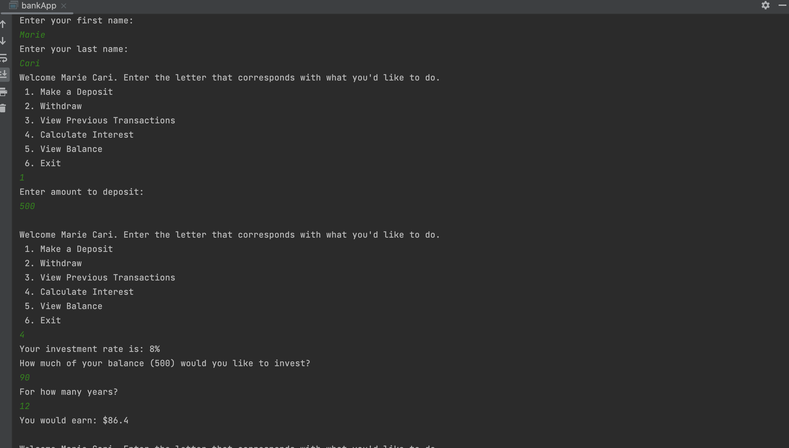

# bankingApp

## Project Description
This project's goal was to create an banking application. It takes in the user's first name and last name. It revels a menu that allows the user to pink from a variety of functions (withdraw, deposit, invest, etc.). 

## Languages
Java

## How to Run
Open in your IDE. Create a new object and insert the first and last name.

## How to Use
This would be used by banks in an app/user website. It would allow users to do things on their end.

## Future Plans
This app could definitely be further developed. Functions like "investing" could be expanded to include a range of options/rates. I'd also like to add a user interface outside of the console.

